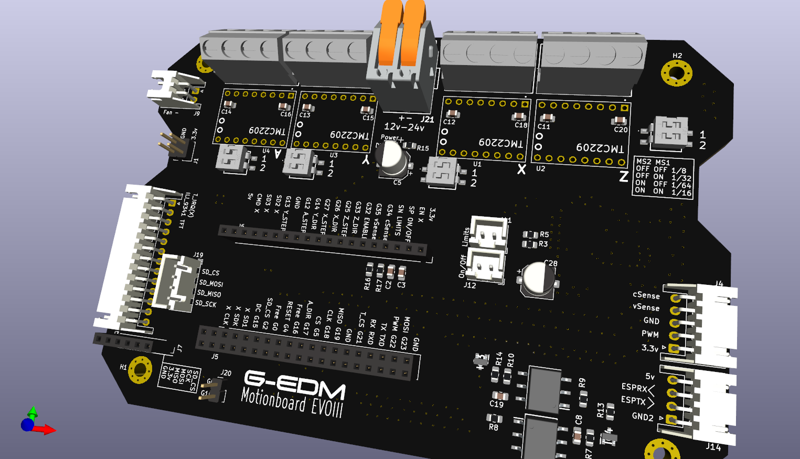

 # G-EDM EVOIII Motionboard
 
 
The new EVOIII motionboard passed all tests but was not yet used in any real cutting operation! Use on your own risk and compare the placement
of the components against the schematics. I made the BOM and centroid files very quick and so far the board was not ordered assembled using those files!
 
 

 
 
This board comes with a more thoughtful placement of all the breakouts and terminals.

# Changes compared to the EVOII
 

    - DIP switches to set the microsteps
    - single JST terminal to connect the motionboard with the pulseboard
    - 200 Ohm current limiting resistors on the feedback pins
    - additional SD card SPI breakout to switch from display SD reader to micro SD reader board (both ways work but only one option at a time)
    - better layout
 
 
The EVOII is still compatible with everything and not deprecated. EVOII and EVOIII boards can be used.
 
 
On the circuit itself not much changed except that this board provides a little pin socket to use a micro SD adapter card instead of the display integrated SD reader. Using the displays SD reader still works too.
 
 
The common micro SD reader boards are build for 5v environments and it needs a little knowledge to get them working with the ESP32s 3.3v levels. I removed the voltage regulator and bridged two pads:
 
 
https://hackaday.io/project/190371-g-edm/log/240049-testing-the-evoiii-motionboard
 
 
This way the wires for the display can be longer without risking data loss on the SD channel. But this feature is for testing only and not needed.

How to select the correct Motionboard?

It is a design choice. Go for the one that fits best. The EVOII and EVOIII board provide the same features (except for the new SD card option) and it is more about the terminal and JST connector positions then anything else. The EVOIII board is a little larger.
