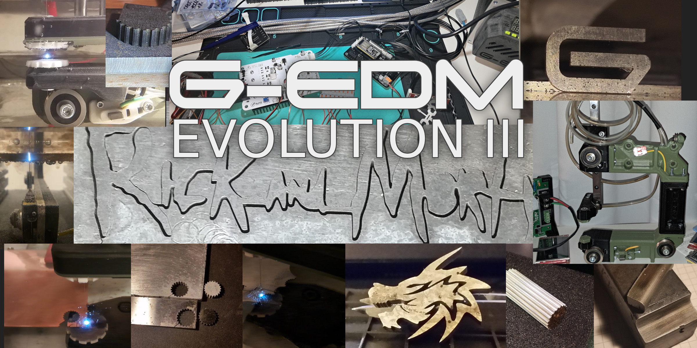
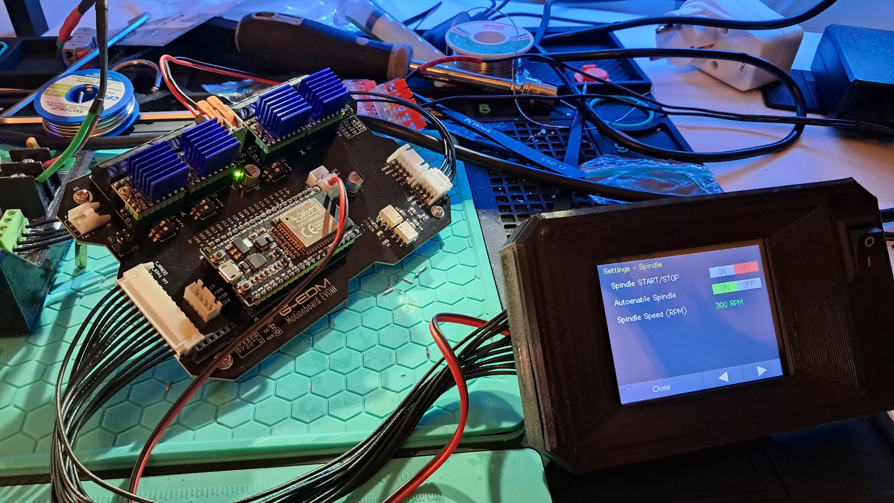
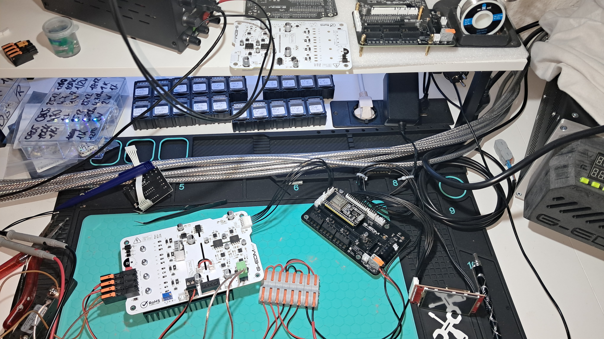
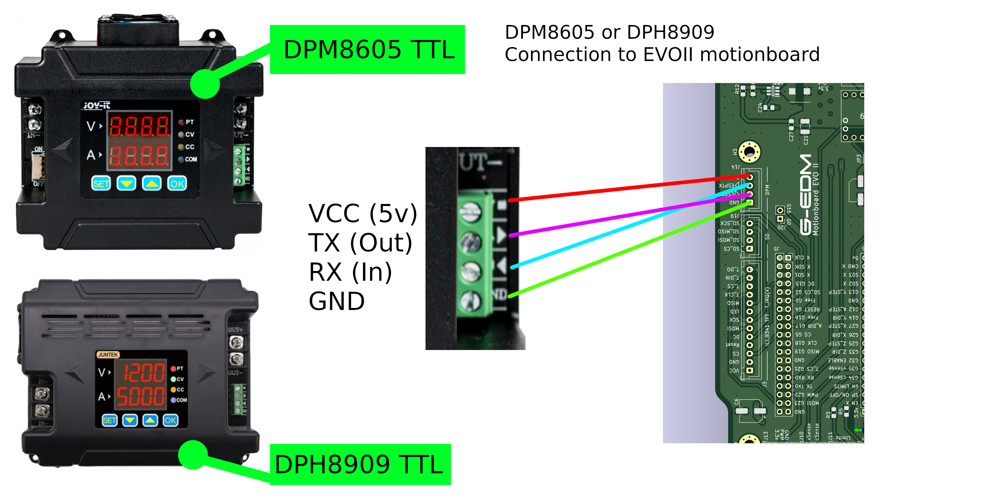
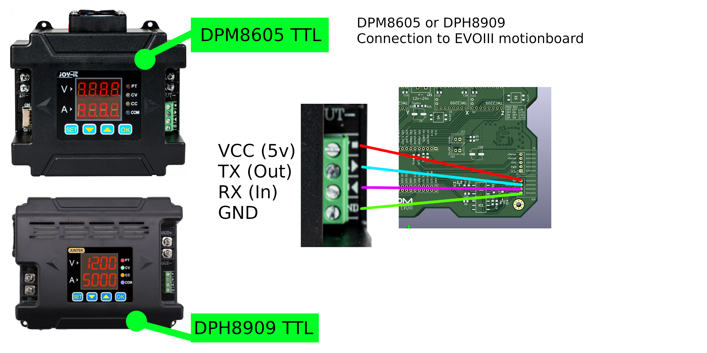
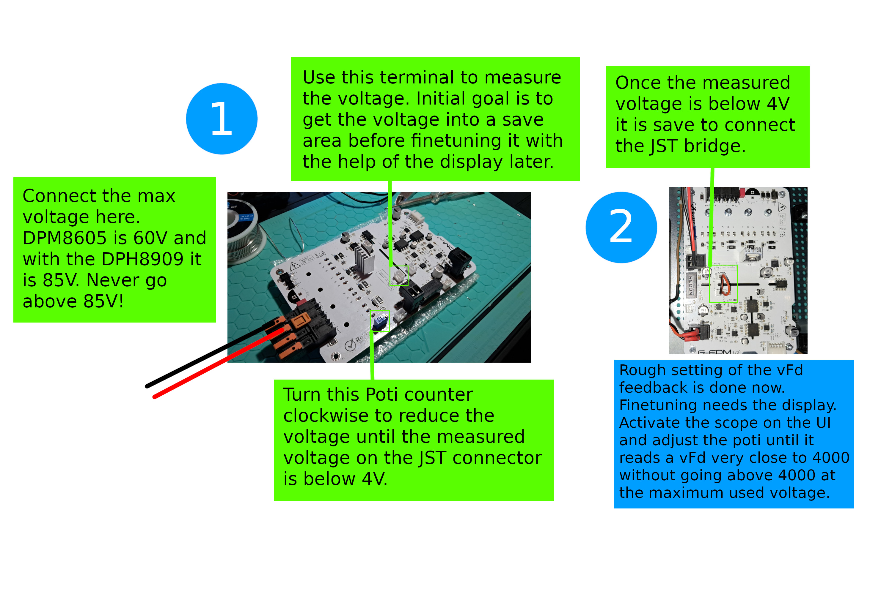
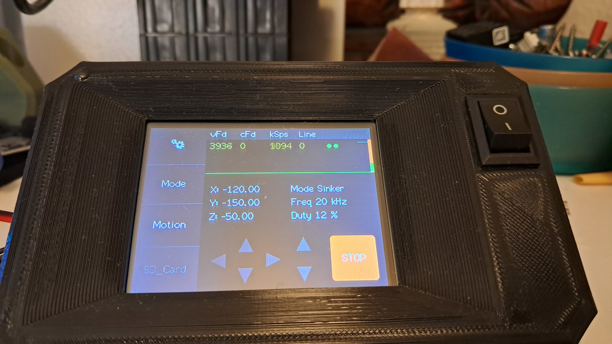

# Emergency help line - A pizza per call
gedm-support@proton.me
 
 

 
 

It is currently recommended to use the EVOII Router frame with the EVOIII wire module. The EVOIII frame concept uses HGR15 with 4040 extrusions which seem not to fit well but the wire module works nice.

To mount the new wire module on the old router it requires just a different X slide which I just added here:
[>>> Backport slide to fit EVOIII wire feeder on EVOII router <<<](https://github.com/G-EDM/G-EDM/blob/main/rev2-x-slide-evoII-backport.stl)
  

# New EVOIII Motionboard is now available on PCBway

    Links are in the PCBway section further down

  

# Tips
The Motionboard should not be placed into the same box as the pulseboard. There is sensitive communication going on with the ESP
and switching loads can make a lot of noise that is able to mess around with the ESP.

I have the motionboard mounted outside the metalbox that contains the pulseunit.
  

# License

All 3D models and FreeCAD files are OpenSource. Feel free to do with it whatever you want.

  

# The old G-EDM EVOII CAD files are still available here:
They don't open with FreeCAD 1.0.0 and to open them it requires a FreeCAD version < 1.0.0. Something like 0.2x or something. 
[>>> G-EDM EVOII Wire extension FreeCAD Project <<<](https://drive.google.com/file/d/1ZBrTBwRvTHIMtCySQIoWtpVMdJbfWR3E/view)
 
[>>> G-EDM EVOII Router FreeCAD Project <<<](https://drive.google.com/file/d/1OkYVYsVrToy4-q0G6XMzgWKsSyYXRRj4/view)
 
 

# G-EDM EVOIII

Github does not allow large files. The FreeCAD (1.0.0) project for the brand new EVOIII router can be found here:
 
 
[>>> G-EDM EVOIII Router FreeCAD 1.0.0 project file <<<](https://drive.google.com/file/d/14w7DUhiVvQ_dd1uddd4wYztnlCYuHb70/view?usp=drive_link)
 
 
The EVOIII router is an all in one solution with integrated electronics, a more lightweight frame and a reduction in print material. 
The new wire module is less complicated to build, easier to wire and uses a modified version of the belt driven wire feeder designed by Alex Treseder for the PICO:
 
    https://github.com/alextreseder/picoEDM
 
 

 
 

At this point the EVOIII router is just a concept. The new wire module seems to be ok but I haven't build the full router yet and can't promise that everything works.
 

This router uses HGR15 linear rails instead of the chunky HGR20 rails. Possible that the slot 8 profiles may not combine well with the small HGR15 rails. Needs further testing.
 
 

# Firmware

https://github.com/G-EDM/G-RBL

 
 

# PCBs

 
 

 
 

# PCBway 

Pulseboard EVOIII: 
https://www.pcbway.com/project/shareproject/G_EDM_EVOIII_Pulseboard_47cdc1b8.html
 
 
Motionboard EVOII (Will be replaced by the EVOIII board):
https://www.pcbway.com/project/shareproject/G_EDM_Low_budget_DIY_Wire_EDM_machine_34e1e043.html
 
 
Motionboard EVOIII (Board works but I haven't ordered it with PCBA service yet. On your own risk.)
https://www.pcbway.com/project/shareproject/W532897ASC41_motionboard_evoIII_rev3_bb113e0f.html

 
 

  

# Connecting the TTL interface from the DPM or DPH to the motionboard

    There are two motionboards. EVOII and in the future the EVOIII board.
    The EVOIII board will replace the EVOII board.
    The EVOII board has RX and TX swapped. The EVOIII has it in the correct order mirroring the output terminal
    on the DPM and DPH.
  
# EVOII Motionboard to DPM/DPH

  

# EVOIII Motionboard to DPM/DPH

  

# Adjust vFd to match the new stock configuration

The new code has a different configuration for the voltage feedback (vFd) short circuit threshold. 
The new default vFd should be almost 4000 @ the max possible voltage. Set the DPM/DPH to the max voltage. if the DPH is used with the 0-80V PSU something around 80V is the max possible. With the DPM it is 60V. Then turn the motionswitch to OFF and press the start button on the display. This will enable the scope. Ensure that the DPM/DPH is also turned on and adjust the Poti on the pulseboard until the reading below "vFd" shows almost 4000. It should never go above 4000.
 
It is very important to have the vFd set to a low voltage feedback before ever connecting the JST bridge to the sensorcircuit!
The Poti on the pulseboard is set to 50% by the manufacturer. With 60v on the power terminal this would put 30v into the sensor circuit.
The currents are small and people already made this mistake without damaging anything but it could damage something.
The OpAmp that is connected to the scaled down bus voltage has a max input rating of around 7V. The circuit is designed for a 0-5v feedback.
 
 
Once the vFd feedback is set it should look like this on the scope with the maximum input voltage turned on. 
To activate the scope turn the motionswitch to OFF, enable the DPM/DPH with the max voltage (max 85v), press the start button on the display.
Now the scope is active and PWM enabled too but with the motionswitch OFF it will not start any process.
Almost 4000 but no spikes above 4000 at the vFd reading.
If the value is >4000 or worse stuck at 4095 turn everything off, buy two pizzas and contact the emergency hotline.
  

  

  

# Donations

    * You want to donate something to support the project? 
    * Paypal: paypal.me/gedmdev
    * Bitcoin: bc1qkz8vwrd3pupewdtyg09qj9nv249vlgdy4ffhyv

