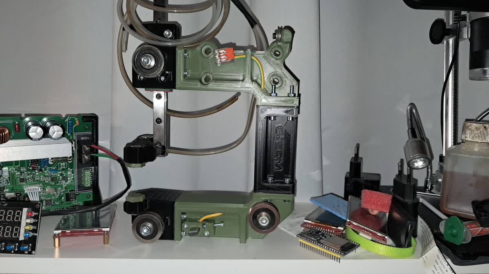
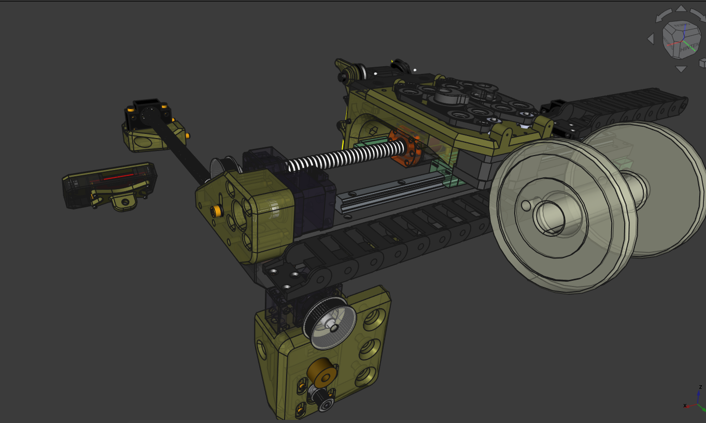
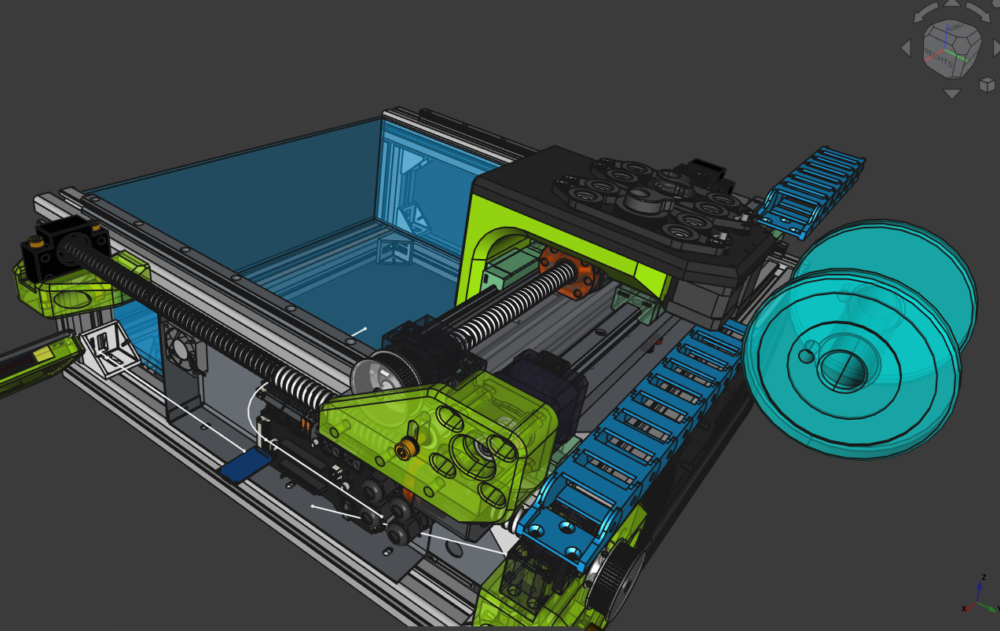
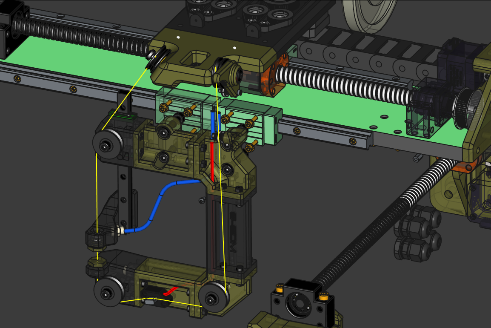

# The old G-EDM EVOII CAD files are still available here:
They don't open with FreeCAD 1.0.0 and to open them it requires a FreeCAD version < 1.0.0. Something like 0.2x or something. 
[>>> G-EDM EVOII Wire extension FreeCAD Project <<<](https://drive.google.com/file/d/1ZBrTBwRvTHIMtCySQIoWtpVMdJbfWR3E/view)
 
[>>> G-EDM EVOII Router FreeCAD Project <<<](https://drive.google.com/file/d/1OkYVYsVrToy4-q0G6XMzgWKsSyYXRRj4/view)
 
 

# G-EDM EVOIII

Github does not allow large files. The FreeCAD (1.0.0) project for the brand new EVOIII router can be found here:
 
 
https://drive.google.com/file/d/14w7DUhiVvQ_dd1uddd4wYztnlCYuHb70/view?usp=drive_link
 
 

At this point the EVOIII router is just a concept. The new wire module seems to be ok but I haven't build the full router yet and can't promise that everything works.
 

This router uses HGR15 linear rails instead of the chunky HGR20 rails. Possible that the slot 8 profiles may not combine well with the small HGR15 rails. Needs further testing.
 
 

# Firmware

https://github.com/G-EDM/G-RBL

 
 

# PCBs

Pulseboard: 
https://www.pcbway.com/project/shareproject/G_EDM_EVOIII_Pulseboard_47cdc1b8.html

Motionboard:
https://www.pcbway.com/project/shareproject/G_EDM_Low_budget_DIY_Wire_EDM_machine_34e1e043.html

 
 

 
 
 
 
 
  

