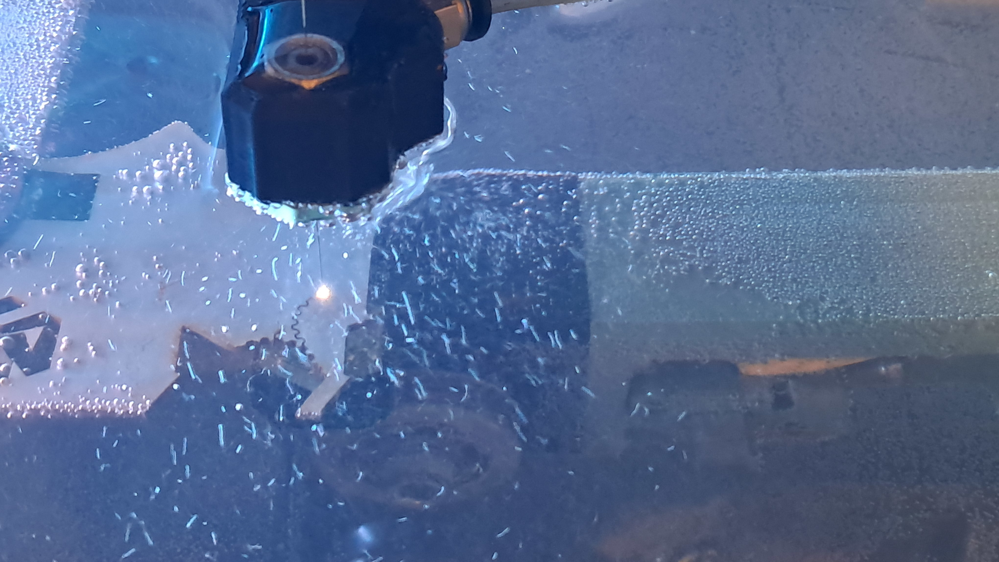
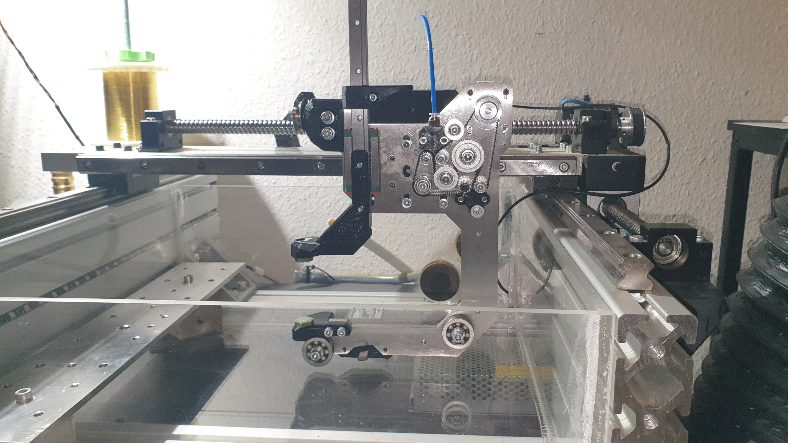
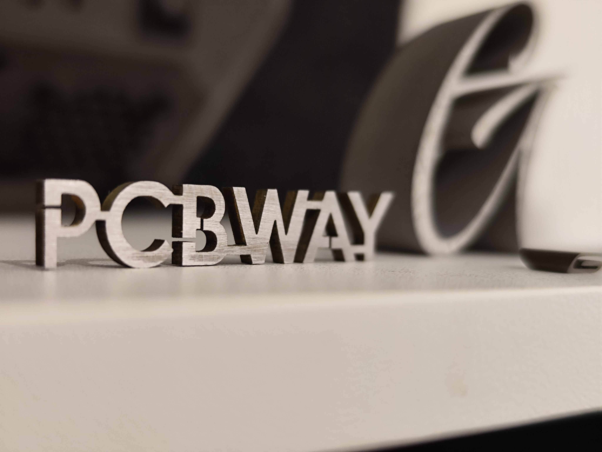
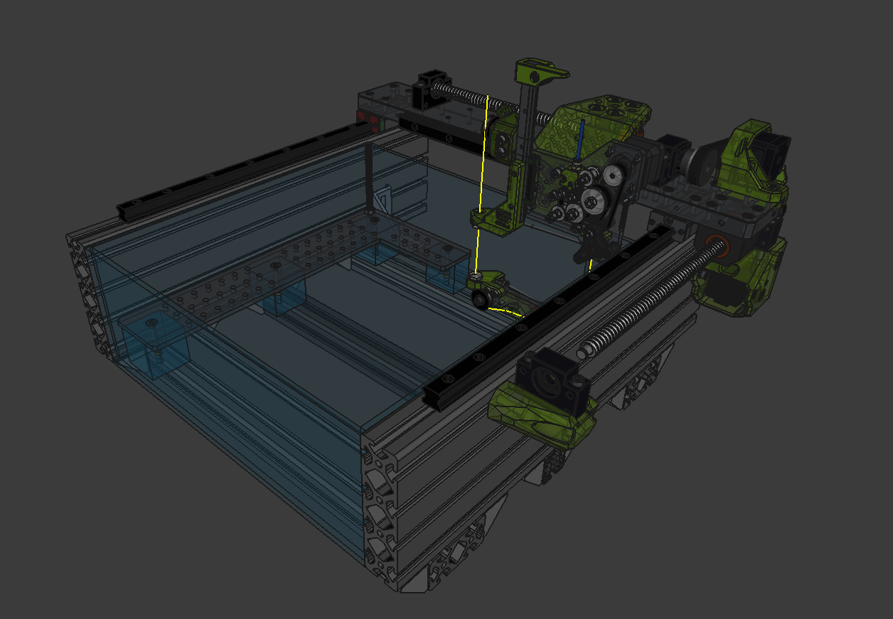
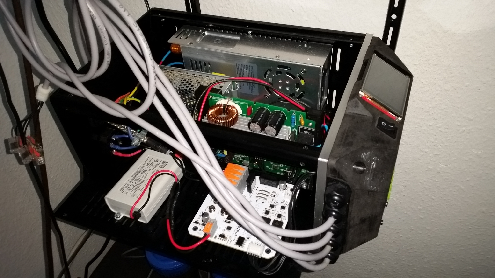
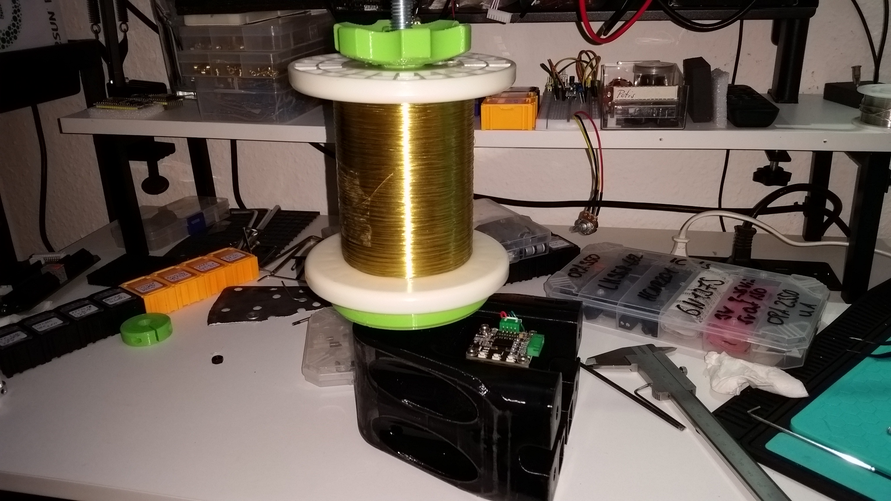

</br>
</br>
</br>


```diff
 ______     _______ ______  _______
|  ____ ___ |______ |     \ |  |  |
|_____|     |______ |_____/ |  |  |      

Overview / Gateway
```                                                               

</br>
</br>





</br>
</br>


# About the project

G-EDM provides Hard- and Software solution for DIY sinker and wire EDM machining targeting the hobby market while trying to keep the project affordable and low budget compatible. While this is one of the main goals there are no compromises made in regards of precision and machine rigidity.

The project evolved over time and so did the mechanical design, the electronics and the firmware.

This repo acts as a gateway to all the other repos and is a way to start the journey into the world of DIY electrical discharge machining.

There are currently two different core version of the electronics and firmware in circulation. The EVOII/III are the initial releases. The new Gapstorm components are the current and upcoming versions. 

Since the sensing circuitry has slightly changed the Gapstorm firmware is not compatible with the EVO pulseboard.

It is possible to upgrade the EVOII and III Pulseboard to match the Gapstorms. A tutorial on how to do that will follow soon. After that upgrade those baords can be used with the new firmware.

</br></br>

# Mechanics

The repo for the new gapstorm router is available here:

[Gapstorm router](https://github.com/G-EDM/gedm-gapstorm/tree/main)


[](https://github.com/G-EDM/gedm-gapstorm/tree/main)


</br></br>

# Electronics

The BOM for the control unit is included on this repo:

[BOM for the control unit](./control-unit-BOM.md)


Files for the PCBs are available on PCBway. To build the electronics it requires two custom PCBs. The switching PCB and the Controlboard aka Motionboard. 

The current PCBs are the Gapstorm Pulseboard and the EVOIII Motionboard.


[Gapstorm Pulseboard on PCBway](https://www.pcbway.com/project/shareproject/G_EDM_Gapstorm_Pulseboard_14dd4341.html)


[EVOIII Motionboard on PCBway](https://www.pcbway.com/project/shareproject/W532897ASC41_motionboard_evoIII_rev3_bb113e0f.html)


</br>
Tip: The Motionboard should be mounted outside of the control box that includes the Pulseboard. One way is shown on the image below using the 3D printed EVOIII Panel.
</br>


More images are available here:

[Gapstorm Image gallery](https://gedm.org/photos/1/album/a655d21b876f5ba21783beb6c846ac8f)


</br></br>

# 3D printed control panel

Designed to fit a 2.8" display (see the BOM)


[EVOIII Control panel](https://github.com/G-EDM/G-EDM-EVOIII-Controlpanel)

</br></br>


# Firmware

The Repo for the Gapstorm firmware:

[Gapstorm G-RBL](https://github.com/G-EDM/G-RBLv3)


The Repo for the EVOII and EVOIII Pulseboard firmware (deprecated and not compatible with the gapstorm Pulseboard)

[EVOII/III G-RBL](https://github.com/G-EDM/G-RBL-experimental)


</br></br>

# Spool holder for P5 spools

FreeCAD file for the spool holder available via google drive

[P5 Spool holder](https://drive.google.com/file/d/1b2BcEC6ozVajnSmm0BhQlqRUxJyKrMW5/view)





</br></br>


# Wiki

There is no real wiki but I posted some of the most important things on the homepage that will act like some kind of a wiki:

[G-EDM FAQ and Wiki](https://gedm.org/user/1)


</br></br>


# Contact

gedm-support@proton.me


[Join the project on Discord](https://discord.gg/vWSmpkzVrj)


[G-EDM Website](https://gedm.org)

</br>
</br>


# Donations

Paypal:
https://www.paypal.com/donate/?hosted_button_id=QP5LHGRUCXXBL

Bitcoin:
bc1qkz8vwrd3pupewdtyg09qj9nv249vlgdy4ffhyv


